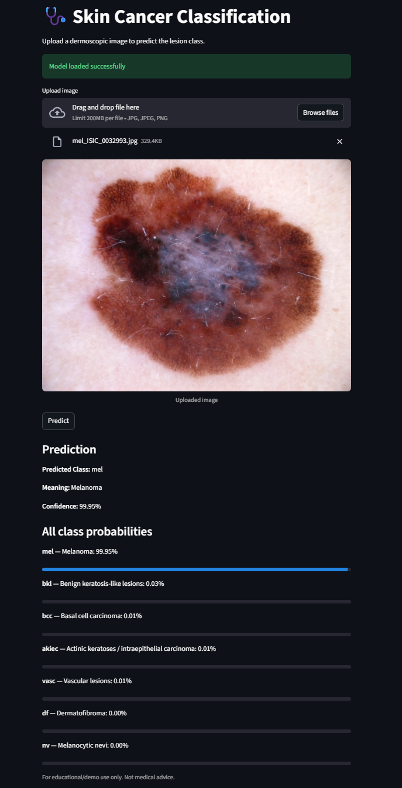

# Comparative Analysis of Deep Learning Models for Skin Cancer Classification

## 📌 Overview
This project performs a comparative analysis of five deep learning models for multi-class skin cancer classification using the HAM10000 dataset.

Models evaluated:
- Custom CNN
- ResNet50
- InceptionV3
- Xception
- InceptionResNetV2

The objective was to compare performance using accuracy, precision, recall, and F1-score.

---

## 📊 Dataset
HAM10000 Dataset  
10,015 dermatoscopic images  
7 skin lesion classes:
- nv
- mel
- bkl
- bcc
- akiec
- vasc
- df

After deduplication: 7,470 images  
Split:
- 64% Training
- 16% Validation
- 20% Testing

---

## 🧠 Models Implemented

| Model | Accuracy |
|-------|----------|
| Custom CNN | 74% |
| ResNet50 | 75% |
| InceptionV3 | 84% |
| Xception | **85.63%** |
| InceptionResNetV2 | 83.62% |

Best Model: **Xception (85.63%)**

---

## ⚙️ Technologies Used
- Python
- PyTorch
- TensorFlow / Keras
- Scikit-learn
- Matplotlib
- KaggleHub

---

## 🚀 How to Run

1. Install dependencies: pip install -r requirements.txt
2. Download dataset: kagglehub.dataset_download("kmader/skin-cancer-mnist-ham10000") (Not uploaded due to size constraints ~ 2GB)
3. Run the notebooks: CNN.ipynb, ResNet50_v2.ipynb, InceptionV3.ipynb, Xception.ipynb, InceptionResnetV2

---

## 📈 Results & Insights
- Xception achieved highest accuracy (85.63%)
- Transfer learning significantly outperformed custom CNN
- Class imbalance affected melanoma recall
- Advanced architectures performed better on minority classes

---
## 🌐 Streamlit Web Application

An interactive **Streamlit application** is included to demonstrate real-time skin lesion classification using the best-performing model (**Xception**).

### ✨ Features
- Upload a dermoscopic image and get instant predictions
- Displays:
  - Predicted class
  - Class description
  - Confidence score
  - All class predictions with probabilities
- Lightweight and easy to run locally

---

### 🖼️ Application Preview



---
## 🧪 Sample Test Images (Unseen Data)

To provide a **fair and reproducible demonstration**, the repository includes a small set of sample test images:

📁 `sample_test_images/`

These images:

- ✅ Are **strictly selected from the held-out test set (`test_df`)**
- ❌ Were **never used during training or validation**
- 🎯 Represent all 7 skin lesion classes
- 🧪 Are used for validating model predictions in a controlled setting

> This ensures that all demonstrated predictions are performed on **unseen data**, avoiding data leakage and maintaining evaluation integrity.

---

## 🚀 Running the Streamlit App

```bash
streamlit run app.py
```
- Then open the browser at http://localhost:8501

---

### 🧠 Trained Model File

The trained model file is also excluded from the repository due to size constraints.

Download the trained Xception model from:

👉 xception_best_model2.txt
